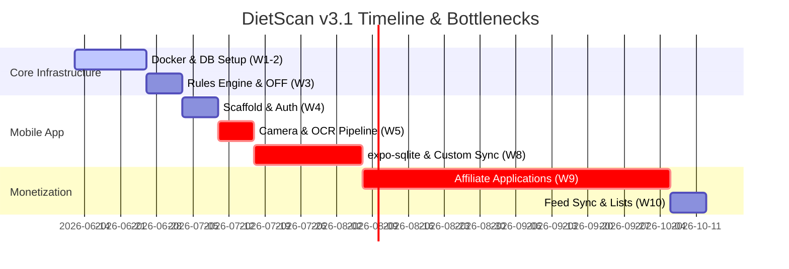

# DietScan v3.1 Architecture & Implementation Review

**Reviewer:** Antigravity (Advanced Agentic Coding Assistant)  
**Date:** June 12, 2026  
**Status:** Complete & Critical Analysis  
**Target Documents:** [FINAL_BLUEPRINT.md](file:///tmp/research-workspace/FINAL_BLUEPRINT.md) (v3.0) and [JOINT_ROADMAP.md](file:///tmp/research-workspace/JOINT_ROADMAP.md) (v3.1)

---

## 1. Executive Summary

This document provides a rigorous, honest, and implementation-focused review of the DietScan mobile utility and its accompanying self-hosted backend infrastructure. 

The overall architecture demonstrates a solid understanding of modern, cost-efficient, open-source stack design. By utilizing self-hosted FOSS tools (PostgreSQL, Valkey, Meilisearch, SuperTokens, Activepieces, GlitchTip, and Umami) on a single VPS, the project achieves an incredibly low monthly running cost ($26–32/mo). The inclusion of an offline-first mobile utility satisfies App Store Guideline 4.2 by keeping the core utility independent of the affiliate monetization layer.

However, the architecture suffers from **underestimated complexity in offline synchronization, data ingestion schedules, OCR text processing accuracy, and resource contention on the self-hosted VPS**. The v3.1 roadmap makes critical assumptions that, if left unaddressed, will result in project delays, database synchronization bugs, and app store rejection.

---

## 2. Evaluation of the 6 Resolved Gaps

The [JOINT_ROADMAP.md](file:///tmp/research-workspace/JOINT_ROADMAP.md) resolves six key architectural gaps identified between the previous iterations. Here is an honest assessment of those resolutions:

### Gap 1: Rate Limiting in-memory vs. Valkey
*   **Resolution:** Agreed to add Valkey and use `rate-limit-redis`.
*   **Reviewer Assessment:** **Correct and Essential.** In-memory rate limiting is a major anti-pattern in Dockerized deployments. Every time the `node-api` container restarts (e.g., during deployment, crashes, or health check failures), all rate limit counters reset. Offloading this state to Valkey is necessary for security (preventing brute-force attacks on auth endpoints) and reliable rate limiting.

### Gap 2: GlitchTip Celery Message Broker
*   **Resolution:** Configured Valkey as the message broker for GlitchTip Celery (`CELERY_BROKER_URL=redis://valkey:6379/1`).
*   **Reviewer Assessment:** **Correct.** Celery requires a message broker to queue tasks. Without it, the Celery worker container (`glitchtip-worker`) would crash on startup. Sharing the Valkey instance for both rate limiting (DB 0) and Celery (DB 1) is resource-efficient and correct for an 8GB VPS setup.

### Gap 3: WatermelonDB -> `expo-sqlite` + Custom Sync
*   **Resolution:** Swapped WatermelonDB for `expo-sqlite` and a custom sync layer to eliminate Expo SDK 56 compatibility risks.
*   **Reviewer Assessment:** **Highly Risky.** While the compatibility concerns with WatermelonDB and modern Expo SDKs are real, the proposed resolution replaces a battle-tested offline sync engine with a "custom sync layer" using raw SQLite, allocated only **one week** in Phase 2 Week 8.
    *   **The Gotcha:** Syncing relational databases offline-first is one of the hardest problems in software engineering. A simple `GET /sync?since=<timestamp>` endpoint does not cover:
        1.  **Deletions (Tombstoning):** If a user deletes a meal log entry offline, how does the server know to delete it, rather than re-downloading it as a "new" record during sync?
        2.  **Conflict Resolution:** If a user edits a shopping list on two different devices offline, how are conflicts resolved? (Last-Write-Wins requires reliable client timestamps, which are prone to clock skew).
        3.  **Foreign Key Order:** Syncing child tables (like `meal_plan_entries`) before parent tables (`meal_plans`) will cause foreign key constraint violations on the client database.
    *   **Recommendation:** Do not write a custom sync protocol from scratch in one week. Instead, use a lightweight, production-ready sync wrapper or strictly define a **unidirectional sync** (server-to-client for products/articles, client-to-server with absolute overwrite for user data like journals/shopping lists) to bypass bidirectional merging.

### Gap 4: Single PostgreSQL DB vs. 3 segregated DBs
*   **Resolution:** Split the single database into `dietscan_core`, `dietscan_services`, and `dietscan_auth` in one PG instance.
*   **Reviewer Assessment:** **Partially Correct, but Config Mismatch.** While separating core application data, service logs, and authentication tables is clean, the configuration of the third-party FOSS tools makes a clean 3-database split difficult:
    *   **SuperTokens:** Can be configured to connect directly to `dietscan_auth`. (Correct)
    *   **Activepieces:** Can connect to `dietscan_services`. (Correct)
    *   **GlitchTip & Umami:** GlitchTip is a Django app that expects its own dedicated database (`glitchtip`), and Umami is a Next.js app that expects its own database (`umami`). Sharing `dietscan_services` between Activepieces, GlitchTip, and Umami is highly discouraged because of migration conflicts and schema ownership issues.
    *   **Correction:** The PostgreSQL instance must initialize **5 separate databases**: `dietscan_core`, `dietscan_auth`, `activepieces`, `glitchtip`, and `umami`. Since they reside on the same PostgreSQL host, this has zero extra memory overhead, but it ensures clean separation and prevents migrations from one service dropping tables in another.

### Gap 5: No DB Migration Tooling
*   **Resolution:** Added `drizzle-kit` for migrations in Phase 1 Week 3.
*   **Reviewer Assessment:** **Correct.** Managing DDL via raw SQL scripts in production leads to schema drift and deployment failures. Using `drizzle-kit` to generate SQL migrations from TypeScript schemas ensures that database changes can be linted, versioned, and safely applied in CI/CD.

### Gap 6: Activepieces Fallback Risk
*   **Resolution:** Documented a fallback Node.js cron script for affiliate feed ingestion.
*   **Reviewer Assessment:** **Highly Recommended.** Activepieces CE is excellent, but running sandboxed execution (`AP_EXECUTION_MODE: "SANDBOXED"`) inside a Docker container requires root access or specific seccomp configurations (like `bubblewrap` permissions) on the host machine. If host permissions are restricted, Activepieces execution will fail. Having the Node.js ingestion script ready as a backup prevents project blockage if Docker sandbox issues arise.

---

## 3. Missed Issues & Architectural Gotchas

Both the original blueprint and the joint roadmap missed several critical engineering realities:

### 1. The Offline Scanning & Rules Engine Contradiction
*   **The Issue:** The blueprint states in Section 5.2.1: *"All OCR runs on-device Neural Processing Unit — zero internet required for text scanning."* However, `json-rules-engine` (the compliance evaluator) is listed as a backend dependency under Node.js API (Section 2.6). 
*   **The Consequence:** If the compliance rules are evaluated on the backend (via `POST /scans`), the app **cannot scan ingredients offline**. The "zero internet required" claim is false.
*   **The Fix:** If true offline scanning is required, `json-rules-engine` must be installed on the mobile client (it runs fine in React Native / Hermes). The app must synchronize the `rules_json` from the server to `expo-sqlite` and run the engine locally. If rules run on the backend, the offline capability is limited to caching previously scanned barcodes.

### 2. On-Device OCR Parsing Limitations
*   **The Issue:** Raw OCR text from food packaging is extremely messy. It contains line wraps, spelling errors (e.g., "soya lecithin" read as "soya lecith1n"), packaging layout noise, allergen warnings, and multi-lingual lists.
*   **The Consequence:** Running a rules engine directly on raw OCR tokens will yield high error rates. A strict Vegan protocol looking for "milk" might miss "m1lk" or "mllk" due to camera glare, or conversely, flag "coconut milk" as a dairy violation because it contains the word "milk".
*   **The Fix:** You need an intermediate text-normalization pipeline. 
    1.  **Levenshtein Distance matching** against a local dictionary of banned ingredients.
    2.  **Exclusion list matching** (e.g., "coconut milk" does not trigger "milk").
    3.  **Parentheses parsing** to resolve sub-ingredients (e.g., "Protein Blend (Whey, Casein)").
    *This pipeline is completely missing from the implementation roadmap.*

### 3. Activepieces Sandbox Execution in Docker
*   **The Issue:** Running `AP_EXECUTION_MODE: "SANDBOXED"` inside the `dietscan-activepieces` container will fail under standard Docker configurations. Activepieces tries to use system calls that Docker blocks by default for security (specifically, user namespaces and mount calls).
*   **The Fix:** The compose file must run Activepieces as `AP_EXECUTION_MODE: "UNSANDBOXED"` (which is safe if you only run your own trusted weekly feed-sync workflows), OR the container must be run with specific privileges (`cap_add: [SYS_ADMIN]`). Unsandboxed mode is the recommended choice for a single-tenant private deployment.

### 4. PostgreSQL Connection Pool Exhaustion
*   **The Issue:** 5 separate services share one Postgres instance (max connections = 100):
    *   Node API: `pg-pool` default (max 10-20)
    *   SuperTokens: default pool (max 10)
    *   Activepieces: TypeORM pool (max 10-20)
    *   GlitchTip Django + Celery worker: (max 20-40)
    *   Umami: default Prisma pool (max 10)
*   **The Consequence:** Under peak load (such as during the weekly Activepieces sync while users are scanning), the PostgreSQL container can easily run out of connections, returning `500 Internal Server Error` to users.
*   **The Fix:** Lower the maximum pool sizes in the environment files of non-user-facing services (e.g., set Activepieces, GlitchTip, and Umami pools to a maximum of 5 connections each).

### 5. Playwright RAM Overhead
*   **The Issue:** Running Playwright (headless Chromium) inside a container on the same 8GB VPS is highly dangerous. A single headless Chrome tab can easily consume 500MB–1.5GB of RAM.
*   **The Consequence:** If Playwright triggers while Meilisearch is indexing and GlitchTip Celery is processing a batch of errors, the VPS will run out of memory. The OS Out-of-Memory (OOM) killer will trigger, likely terminating Meilisearch or PostgreSQL.
*   **The Fix:** Keep the `growth` profile deactivated. Do not run Playwright on the primary server. If automation is required later, run it on a separate $4/mo micro-instance or use a serverless browser service (e.g., Browserless.io).

---

## 4. Timeline Feasibility Assessment

The 16-week timeline is highly optimized but contains several severe bottlenecks that will likely push the launch back by 4–6 weeks:

### Critical Bottlenecks:

1.  **Phase 2 Week 5 (Camera + OCR Frame Processor):**
    Writing a custom frame processor in React Native that runs at 10-15 FPS, restricts search to a bounding box, tokenizes text, and maintains performance across both iOS (Vision) and Android (ML Kit) is highly complex. One week is insufficient. **Estimated actual time: 2–3 weeks.**
2.  **Phase 2 Week 8 (expo-sqlite + Custom Sync):**
    As detailed in Gap 3, writing an offline-first synchronization engine from scratch in one week is a recipe for data corruption. **Estimated actual time: 3 weeks.**
3.  **Phase 3 Week 9 (Affiliate Network Approvals):**
    The roadmap schedules affiliate program applications for Week 9. 
    *   **The Reality:** High-tier networks like CJ Affiliate (for Thrive Market, Vitacost, Vitamin Shoppe) or Partnerize (for iHerb) do not approve applications instantly. They manually review the app's website, privacy policy, and traffic. Thrive Market approvals can take **8–10 weeks** and require a fully functional demo video or beta app build.
    *   **The Consequence:** The project will halt in Week 10 because the developer will not have API keys or feed access to test the Activepieces sync.
    *   **The Fix:** Shift affiliate applications to **Week 1**. Apply using a landing page explaining the app utility. Do not wait until the app is built to apply.

---

## 5. The Biggest Concern (#1 Risk)

The single greatest risk to this project is **DevOps/Infrastructure Resource Exhaustion and Operational Overhead**.

The architecture attempts to host a complete enterprise-grade SaaS stack on a single 8GB VPS:
*   PostgreSQL 17 (holding 5 databases)
*   Valkey (Cache + Celery Broker)
*   Meilisearch (CE)
*   SuperTokens Core
*   Activepieces (Workflow automation)
*   GlitchTip Web + Worker (Celery task queue)
*   Umami Analytics
*   Node.js API
*   Traefik Reverse Proxy

This is a massive footprint for an $30/month server. If Meilisearch starts indexing a large CSV product feed, or GlitchTip processes a sudden spike in client-side errors, or the Celery worker leaks memory (common in long-running Python/Django processes), the VPS will experience memory exhaustion. The resulting OOM crash will bring down the Node.js API, disrupting the user experience.

### Mitigation:
1.  **Disable GlitchTip Workers in Production initially:** Use a lightweight, hosted error tracker (like Sentry's developer tier) or write errors to standard Docker logs and use a lightweight log viewer (like Dozzle) to reclaim ~1GB of RAM.
2.  **Limit Valkey Memory:** Set `maxmemory 512mb` and `maxmemory-policy allkeys-lru` in `valkey.conf` to prevent memory leaks from crashing the system.
3.  **Defer Activepieces:** If resource utilization spikes, replace Activepieces with the Node.js cron script fallback immediately. Node.js processes are far lighter than the Activepieces runner environment.

---

## 6. Recommendations & Action Items

To ensure the success of the DietScan v3.1 build, implement the following changes immediately:

1.  **Database DDL Update:** Modify the database initialization scripts to create 5 databases instead of 3:
    *   `dietscan_core`
    *   `dietscan_auth` (SuperTokens)
    *   `activepieces`
    *   `glitchtip`
    *   `umami`
2.  **Apply for Affiliate Networks Now:** Do not wait for Week 9. Submit applications to CJ Affiliate, Impact, FlexOffers, Awin, and Partnerize immediately using the mockups and architectural blueprints as proof of concept.
3.  **Run Activepieces in Unsandboxed Mode:** In `docker-compose.yml`, change `AP_EXECUTION_MODE: "SANDBOXED"` to `"UNSANDBOXED"` to prevent permission crashes inside the container.
4.  **Client-Side Rules Engine:** Install `json-rules-engine` in the React Native project to run OCR scans locally without internet connectivity.
5.  **Simplify Offline Sync:** Define a clear conflict resolution strategy. Force the client to overwrite the server (or vice-versa) for high-frequency user data, rather than trying to build a custom bidirectional merge engine.